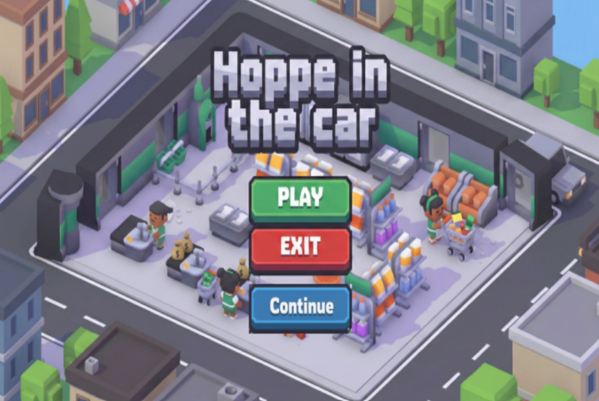

# Hoope In The Car

Hoope In The Car is a videogame implemented in C with a custom [framework](https://github.com/upf-gti/TJE_Framework) provided by UPF.

The goal is to empty various supermakets of valuable items by stealing one after another.

It is built as a local multiplayer game where the first player plays with WASD + E keys and the second one with the arrows + L. They will have to cooperate and help each other in order to lift heavy objects.
